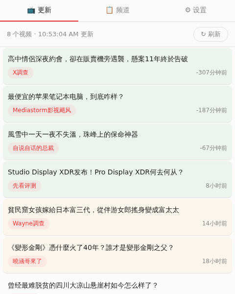
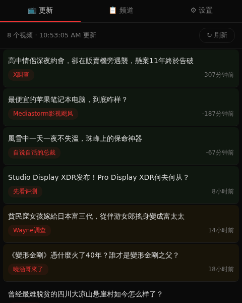
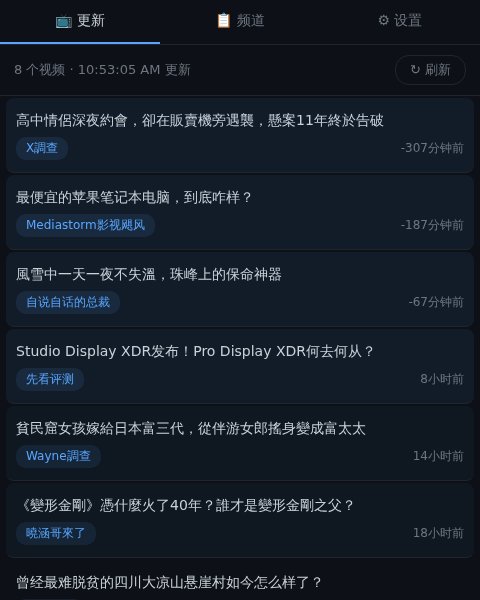
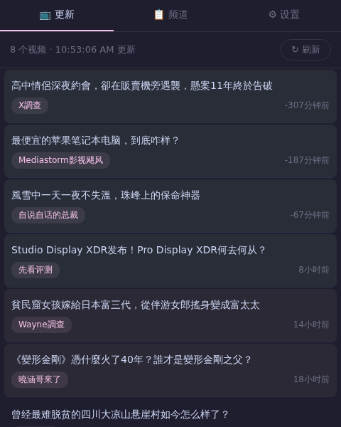
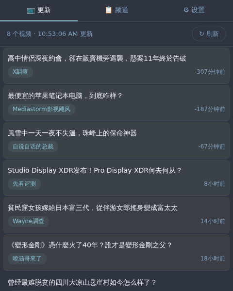
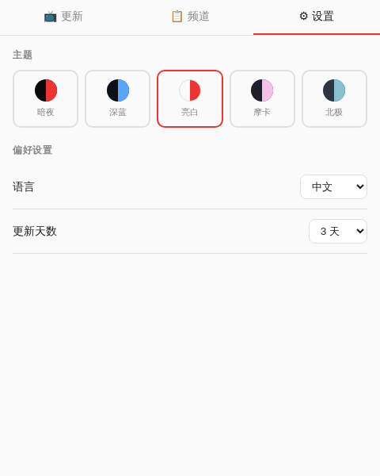

# YouTube Sub Tracker

A lightweight Chrome extension that shows recent videos from your YouTube subscriptions — without logging in or relying on YouTube's algorithm.

## Features

- 📺 View videos published in the last 3 / 7 / 15 days from channels you follow
- 📦 Add channels one by one or batch import up to 50 at once
- 🎨 5 beautiful themes: Light, Dark, Midnight, Mocha, Nord
- 🌍 4 languages: 中文, English, 日本語, 한국어
- 🔴 Badge notification for new unwatched videos
- ⚡ Runs 100% locally — no account needed, no data collected
- 🔒 Privacy-first: fetches only public YouTube RSS feeds, stores everything in your browser

## Install

### Chrome Web Store
*(Coming soon)*

### Manual Install
1. Download or clone this repo
2. Open `chrome://extensions`
3. Enable **Developer mode** (top right)
4. Click **Load unpacked** → select the project folder

## How It Works

Click the extension icon to see a clean list of recent uploads from your channels. Videos are grouped by date with subtle color coding.

The extension fetches public YouTube RSS feeds (`youtube.com/feeds/videos.xml`) — no API key needed, no sign-in required.

## Screenshots

| Light | Dark | Midnight |
|-------|------|----------|
|  |  |  |

| Mocha | Nord | Settings |
|-------|------|----------|
|  |  |  |

## Privacy

No data collection. No analytics. No tracking. Everything stays in your browser.

[Full Privacy Policy](https://lgggg.de/privacy.html)

## License

MIT
